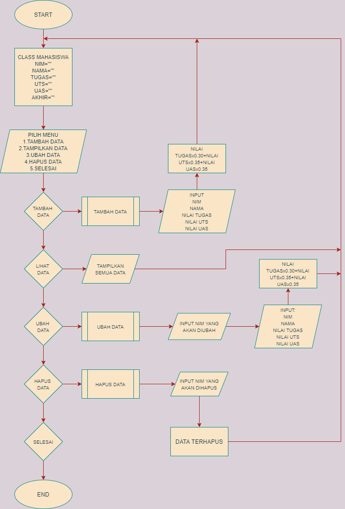
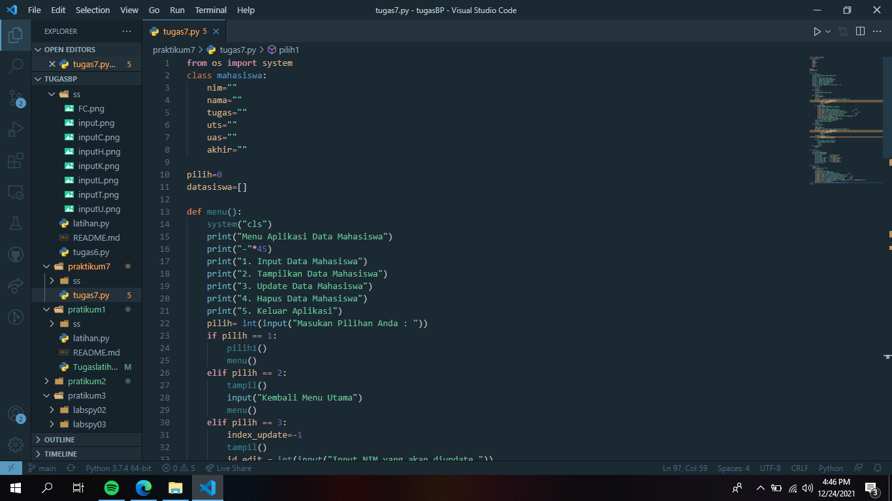
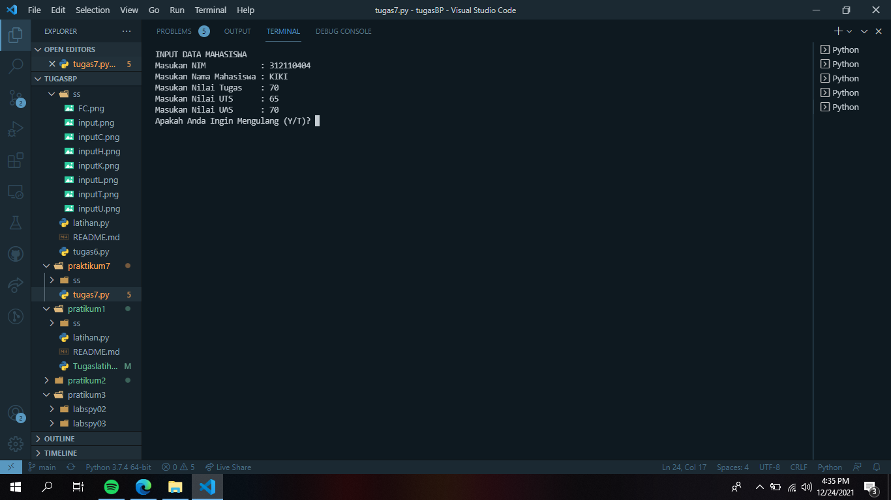
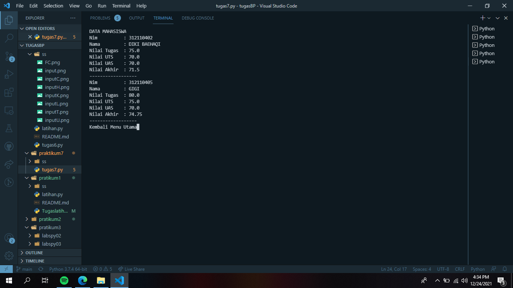
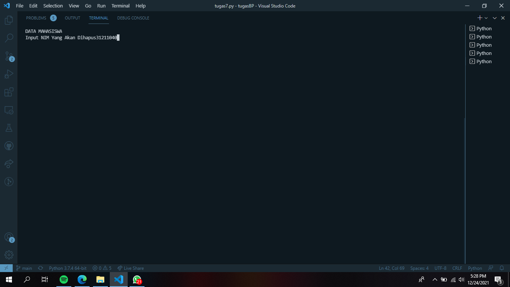
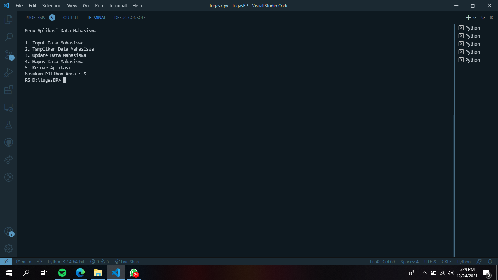

# praktikum7
## Input data mahasiswa menggunakan bahasa python

### Profil
Nama : Diki Baehaqi

Nim : 312110402

Kelas : TI.C1.21

### flowchart dari input data mahasiswa
Membuat Program Sederhana Menampilkan Daftar Nilai Mahasiswa Dengan Ketentuan Sebagai Berikut :
Program dibuat dengan penggunaan class
menampilkan menu pilihan:

Tambah data

Tampilkan data

Hapus Data

Ubah data

### source code program python penggunaan class

### menu input data

### menu tampilkan data

### menu hapus  data

### menu Output Keluar program

TERIMAKASIH
